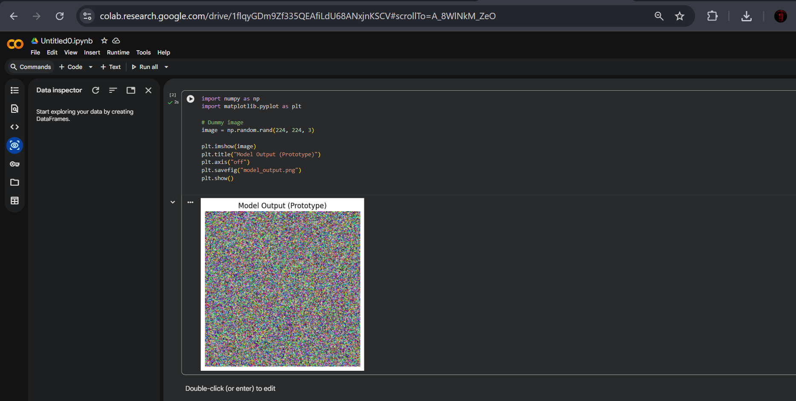
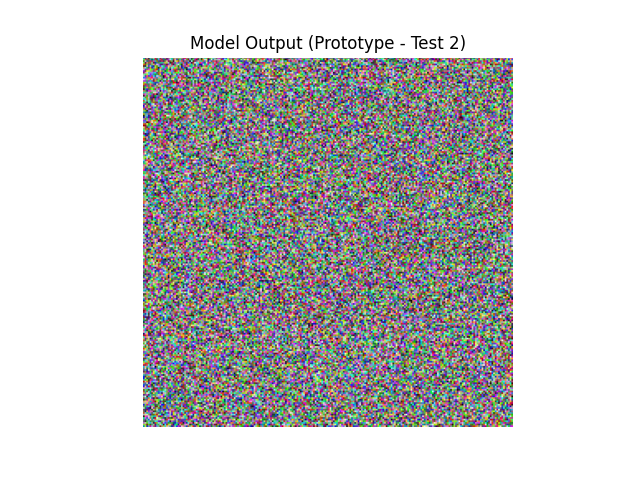

🫟 Oil Spill Detection from SAR Satellite Images

### 🌐 Project Overview
This project focuses on detecting oil spill regions from SAR satellite images
using deep learning–based image segmentation techniques. SAR imagery is useful
for ocean monitoring as it is unaffected by weather conditions, but it is
difficult to analyze manually due to noise and complex patterns.

---

### ❗Problem Statement
Manual inspection of SAR satellite images for oil spill detection is time-
consuming and not scalable. An automated system is required to accurately
identify oil spill regions from large volumes of satellite data.

---

### 🎯 Project Objectives
- Perform pixel-level detection of oil spill regions
- Reduce dependency on manual image analysis
- Study deep learning–based segmentation techniques
- Understand end-to-end workflow for SAR image segmentation

---

### 📊 Dataset Description
- Grayscale SAR satellite images
- Corresponding binary segmentation masks
- Highly imbalanced classes (oil vs background)
- Dataset stored externally due to large size

---

### 🎯 Data Preprocessing
- Image resizing to a fixed input resolution
- Pixel value normalization
- Mask cleaning and alignment
- Data augmentation techniques:
  - Horizontal flipping
  - Rotation

---

### 🤖 Model Approach
- A deep learning model is used to detect oil spill areas
- The model looks at image patterns to identify oil regions
- The output highlights oil spill areas in the image

---

### 🏋️ Training and Evaluation
- The model is trained using labeled satellite images
- After training, the model is tested on new images
- Results are checked to see how accurately oil spills are detected

---

## 📊 Results & Visualizations
The following screenshots show prototype-level output visualizations
generated during initial testing of the model pipeline.

  
  

---

### 📁 Repository Structure
- Notebook for preprocessing, training, and evaluation
- Saved model outputs and result visualizations
- Configuration and dependency files
- Project documentation

---

### 🚀 Deployment
- Project developed and tested in a notebook environment
- Deployment workflow was studied
- No separate live deployment created for this contribution

---

### 🎓 Learning Outcomes
- Understanding SAR image characteristics
- Handling class imbalance in segmentation tasks
- Practical use of U-Net architectures
- Experience with GitHub collaboration and version control

---

### 👤 Contributor
Guru Sunitha Reddy Seelam
